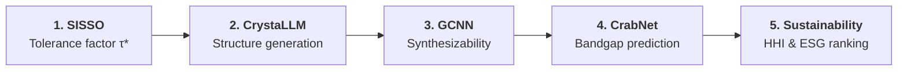

# TF-ChPVK-PV

**ML-guided screening of chalcogenide perovskites as solar energy materials**

<div markdown="block" class="action-buttons">
  <a href="https://github.com/GarzonDiegoFEUP/TF-ChPVK-PV" class="md-button action-button"><svg xmlns="http://www.w3.org/2000/svg" viewBox="0 0 16 16" width="14" height="14"><path fill="currentColor" d="M8 0C3.58 0 0 3.58 0 8c0 3.54 2.29 6.53 5.47 7.59.4.07.55-.17.55-.38 0-.19-.01-.82-.01-1.49-2.01.37-2.53-.49-2.69-.94-.09-.23-.48-.94-.82-1.13-.28-.15-.68-.52-.01-.53.63-.01 1.08.58 1.23.82.72 1.21 1.87.87 2.33.66.07-.52.28-.87.51-1.07-1.78-.2-3.64-.89-3.64-3.95 0-.87.31-1.59.82-2.15-.08-.2-.36-1.02.08-2.12 0 0 .67-.21 2.2.82.64-.18 1.32-.27 2-.27.68 0 1.36.09 2 .27 1.53-1.04 2.2-.82 2.2-.82.44 1.1.16 1.92.08 2.12.51.56.82 1.27.82 2.15 0 3.07-1.87 3.75-3.65 3.95.29.25.54.73.54 1.48 0 1.07-.01 1.93-.01 2.2 0 .21.15.46.55.38A8.013 8.013 0 0016 8c0-4.42-3.58-8-8-8z"></path></svg> GitHub Repository</a>
</div>

## Overview

Chalcogenide perovskites (ABX₃, X = S²⁻, Se²⁻) have emerged as promising absorber materials for next-generation photovoltaic devices, yet their experimental realization remains limited by competing phases, structural polymorphism, and synthetic challenges.

This repository presents a fully **data-driven and experimentally grounded screening framework** to assess the stability and experimental feasibility of chalcogenide perovskites, integrating interpretable analytical descriptors, machine-learning models, and sustainability metrics.

> D. A. Garzón, L. Himanen, L. Andrade, S. Sadewasser, J. A. Márquez,
> *"ML-guided screening of chalcogenide perovskites as solar energy materials"* (2026).

## Screening Pipeline

The framework chains five complementary computational and data-driven methods:



| Step | Method | Purpose |
|------|--------|---------|
| **1** | SISSO-derived tolerance factor (τ\*) | Interpretable analytical descriptor for perovskite structural stability |
| **2** | CrystaLLM crystal structure generation | Generative prediction to validate corner-sharing perovskite-type topology |
| **3** | GCNN crystal-likeness scoring | Experimental plausibility and synthesizability assessment |
| **4** | CrabNet bandgap estimation | Composition-based prediction trained on experimental data |
| **5** | Sustainability analysis | Multi-objective ranking using HHI, ESG scores, and supply risk metrics |

<div markdown="block" class="framework-grid">

<div markdown="block">

### :material-rocket-launch: Getting Started
**Installation & setup**

Set up the environment with uv or pip, configure API keys, and prepare the Jupyter kernel for running the analysis pipeline.

[**Get Started**](getting-started.md)
</div>

<div markdown="block">

### :material-pipe: Pipeline Notebooks
**Step-by-step analysis**

Run the full screening pipeline — from SISSO feature engineering through CrystaLLM validation, CrabNet bandgap prediction, and sustainability ranking.

[**View Pipeline**](pipeline.md)
</div>

<div markdown="block">

### :material-book-open-variant: References & Citation
**Methods and attribution**

Key references for the methods used in this pipeline, BibTeX citation, acknowledgements, and license information.

[**View References**](references.md)
</div>

</div>

## Key Features

- **Interpretable Descriptors**: SISSO-derived tolerance factor (τ\*) outperforming the classical Goldschmidt tolerance factor on experimental data
- **Generative Structure Validation**: CrystaLLM crystal structure generation to confirm perovskite-type topology
- **ML Bandgap Prediction**: CrabNet composition-based models trained on experimental halide perovskite and chalcogenide semiconductor data
- **Sustainability Metrics**: Multi-objective ranking integrating element scarcity (HHI), ESG risk, and supply chain metrics
- **Synthesizability Scoring**: GCNN-based crystal-likeness assessment for experimental plausibility
- **Fully Reproducible**: All data, code, and trained models are openly available under the MIT License

## Citation

*Preprint coming soon. Citation will be added upon publication.*

```bibtex
@article{garzon2026mlguided,
  title={ML-guided screening of chalcogenide perovskites as solar energy materials},
  author={Garz{\'o}n, Diego A. and Himanen, Lauri and Andrade, Luisa
          and Sadewasser, Sascha and M{\'a}rquez, Jos{\'e} A.},
  year={2026}
}
```
